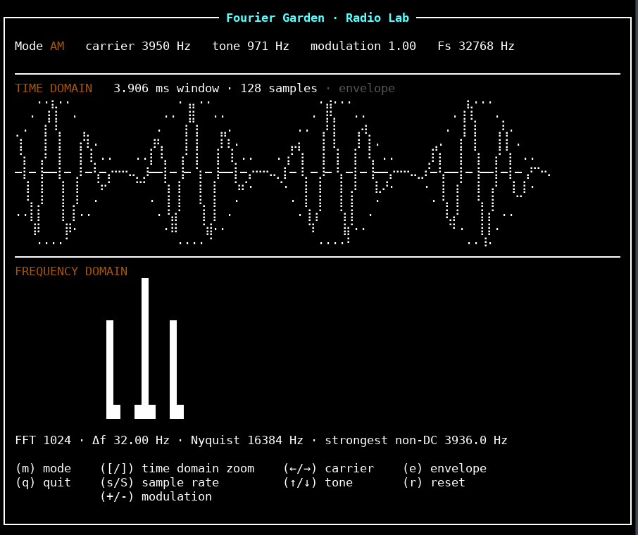
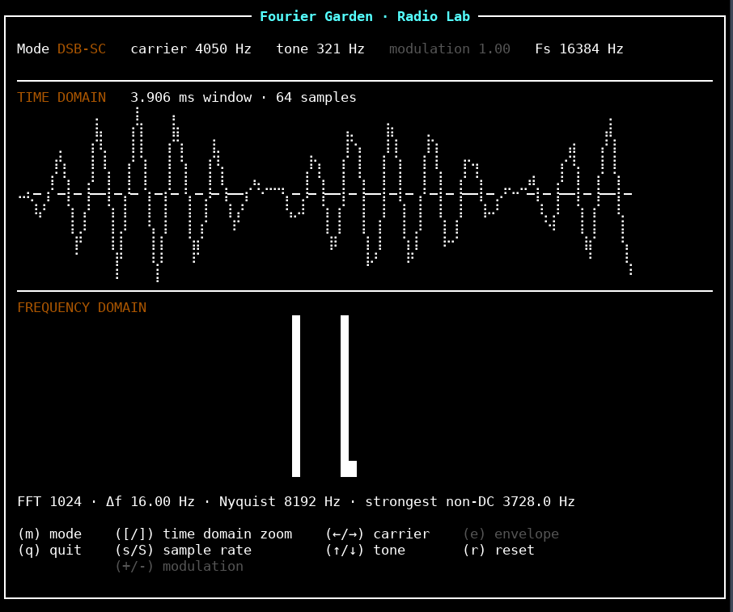
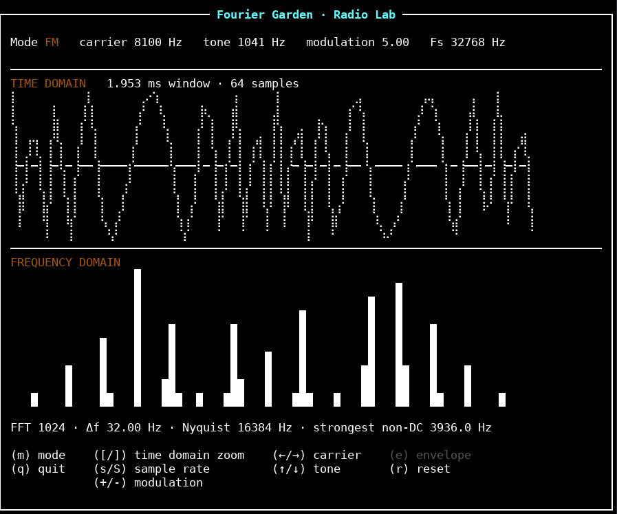
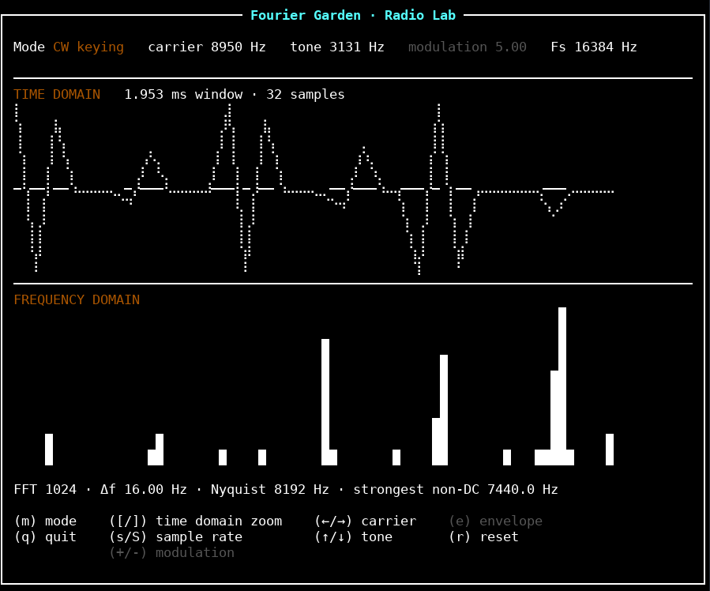
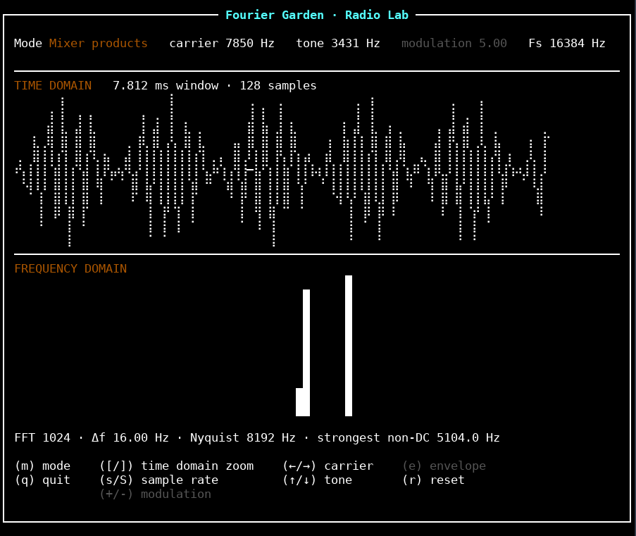
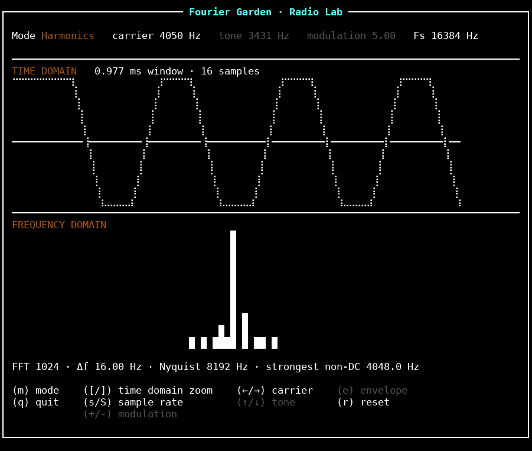
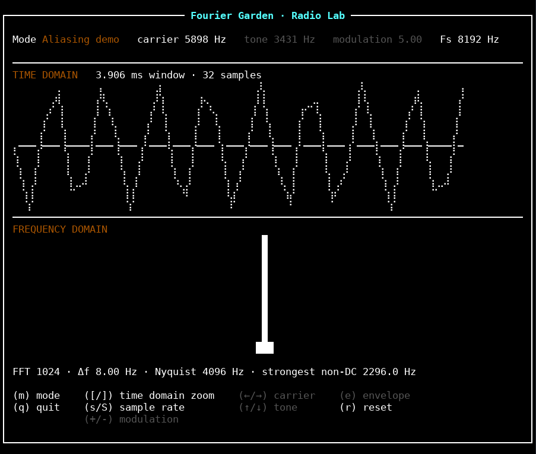

# Fourier Garden

**Fourier Garden** is a small Haskell TUI for exploring the signal-processing ideas that show up in amateur radio: spectra, AM/DSB modulation, FM sidebands, CW keying and aliasing.

The point is deliberately not to hide the maths behind a DSP package, therefore, the repository contains its own DFT, radix-2 FFT and inverse transform, with the TUI layered on top of a pure signal-processing core.

See the [settings worth trying](#settings-worth-trying) for reproducible settings covering every mode.

[](AM.png)

## What the code currently does

- generates sine carriers and message tones
- AM (ordinary amplitude modulation)
- DSB-SC (double-sideband suppressed carrier)
- simple sinusoidal FM
- hard-keyed CW-style carrier
- mixer products (sum/difference frequencies)
- square-wave harmonic spectrum
- an aliasing demonstration tied to the chosen sample rate
- zoomable time-domain terminal plot: connected Braille waveform at up to two samples per column, min/max-preserving rendering for denser views
- optional AM envelope guide
- FFT resolution and Nyquist readout
- live Fourier magnitude spectrum
- naïve `O(n²)` DFT
- radix-2 `O(n log n)` FFT, with DFT fallback for non-powers of two
- inverse FFT
- regression tests plus QuickCheck properties for complex transforms, normalization, and plot dimensions

The TUI starts in AM mode with a 1000 Hz carrier, 100 Hz message tone,
modulation depth 0.70, sample rate 8192 Hz, a nominal 20 ms time window,
and the envelope guide enabled. `r` restores to these defaults.

From reset, `m` cycles through **AM → DSB-SC → FM → CW keying → Mixer products
→ Harmonics → Aliasing demo → Pure carrier → AM**. Inactive controls and
parameter values are dimmed with no effect when pressed.

## Controls

| Key                 | Action                                                 |
| ---------------------| --------------------------------------------------------|
| `m`                 | cycle signal/modulation mode                           |
| `←` / `→`           | carrier frequency (50 Hz steps)                        |
| `Shift` + `←` / `→` | carrier frequency (10 Hz steps)                        |
| `Ctrl` + `←` / `→`  | carrier frequency (1 Hz steps)                         |
| `↑` / `↓`           | message/keying frequency (10 Hz steps)                 |
| `Shift` + `↑` / `↓` | message/keying frequency (1 Hz steps)                  |
| `+` / `-`           | modulation depth/index in 0.1 steps (AM: 0–1; FM: 0–5) |
| `[` / `]`           | halve / double the nominal time window (0.05–2000 ms)  |
| `e`                 | toggle AM envelope guide                               |
| `s` / `S`           | double / halve sample rate (512–65536 Hz)              |
| `r`                 | reset                                                  |
| `q`                 | quit                                                   |

Carrier and tone frequencies have a 1 Hz minimum. Carrier adjustment is disabled
in aliasing mode. Tone adjustment works in AM, DSB-SC, FM, CW, and Mixer,
modulation adjustment works only in AM and FM and the envelope toggle only works in AM.

## Running

Install GHC (base >= 4.16, with GHC2021 support) and Cabal (Cabal file format 3.0 or newer), then:

```bash
cabal update
cabal run fourier-garden
```

Use a terminal with Unicode Braille support. At startup the app requests a
85 × 38 terminal, terminals may ignore this request. The plots have a fixed width of 80 columns.

Run the 10 regression checks and 800 generated property cases with:

```bash
cabal test
```

Cabal resolves Brick and Vty UI dependencies, plus QuickCheck for tests.

## Screenshots

Here's some screenshots!

| DSB-SC | FM |
| --- | --- |
| [](DSB-SC.png) | [](FM.png) |
| **CW keying** | **Mixer products** |
| [](CW.png) | [](mix.png) |
| **Harmonics** | **Aliasing demo** |
| [](harmonics.png) | [](aliaDem.png) |

## Settings worth trying

Press `r` before setting up each row.

| Look                   | Mode           | Carrier (Hz) | Tone (Hz) | Depth / index | Sample rate (Hz) | Time window (ms)¹ | What to notice                                                                                             |
| ------------------------| ----------------| -------------:| ----------:| --------------:| -----------------:| ------------------:| ------------------------------------------------------------------------------------------------------------|
| AM envelope            | AM             | 1000         | 120       | 0.70          | 8192             | 20                | Carrier inside a dotted envelope, spectrum peaks at 880, 1,000, and 1120 Hz.                               |
| Deep AM                | AM             | 1000         | 100       | 1.00          | 8192             | 20                | The envelope pinches down to zero between broad lobes.                                                     |
| Suppressed carrier     | DSB-SC         | 1000         | 120       | —             | 8192             | 20                | Two sidebands at 880 and 1120 Hz, the central carrier disappears.                                          |
| FM stretch             | FM             | 1000         | 100       | 3.00          | 8192             | 10                | About ten cycles: close spacing at the edges, wider in the middle. Frequency varies from 700 to 1300 Hz.   |
| Plain carrier close-up | Pure carrier   | 1000         | —         | —             | 8192             | 2.5               | About 2½ evenly spaced cycles in connected rendering.                                                      |
| Square-wave harmonics  | Harmonics      | 1000         | —         | —             | 8192             | 2.5               | Flat tops and sharp transitions, odd harmonics in the spectrum, with higher ones folding through aliasing. |
| Mixer products         | Mixer products | 1000         | 120       | —             | 8192             | 20                | Multiplying two sine waves produces sum/difference peaks at 880 and 1120 Hz.                               |
| Keyed bursts           | CW keying      | 1000         | 100       | —             | 8192             | 20                | Two carrier bursts separated by silence, abrupt switching spreads spectral energy.                         |
| Aliasing close-up      | Aliasing demo  | 5898.24²     | —         | —             | 8192             | 2.5               | An above-Nyquist carrier appears at 2293.76 Hz (strongest FFT bin: 2296 Hz).                               |

### Reading the plots

Plots scale amplitude automatically, and connected samples are not an exact
continuous waveform. The spectrum has no frequency ticks and uses a fixed
1024-sample FFT. Off-bin tones leak into neighboring bins. Time zoom does not
change that FFT window, the time view itself is capped at 8192 samples.

At the default sample rate, FFT bin spacing is 8 Hz and Nyquist is 4096 Hz.
The spectrum spans DC through Nyquist, grouping bins into 76 columns by their
maximum magnitude. Nearby peaks can share a column. The strongest non-DC
readout identifies an FFT bin, it isn't an exact estimate of the input frequency.
The plots recompute when settings change.

## Architecture

```text
app/Main.hs
    │
    ▼
RadioLab.App          Brick event loop + rendering
    │
    ├──── RadioLab.Plot
    │
    └──── pure signal-processing core
          ├── Signal.hs       waveforms + sampling
          ├── Modulation.hs   AM / DSB-SC / FM / CW
          ├── Fourier.hs      DFT / FFT / IFFT + spectrum
          └── Filter.hs       frequency-domain filters
```

`Signal` is represented as a function from time to amplitude:

```haskell
type Signal = Double -> Double
```

That means modulation composes naturally. For example, AM is just another signal transformation:

```haskell
am :: Hertz -> Double -> Signal -> Signal
am carrierHz depth message t =
    (1 + clamp 0 1 depth * message t) * cos (2 * pi * carrierHz * t)
```

Here `clamp` bounds the depth between 0 and 1.

The library also provides sawtooth, triangle, and chirp signals, normalization,
RMS, inverse DFT/FFT, and low-pass, high-pass, band-pass, and notch filters on
Fourier bins. These are not exposed as interactive UI controls.

The UI knows nothing about the implementation of the Fourier transform. It asks the pure core for samples and spectrum bins, then renders them.

## License

Fourier Garden is free software, you can redistribute it and/or modify it under
the terms of the GNU General Public License as published by the Free Software
Foundation, either version 3 of the License, or (at your option) any later version
(`GPL-3.0-or-later`).

It is distributed without any warranty, including the implied warranties of
merchantability or fitness for a particular purpose. See [LICENSE](LICENSE)
for the full terms.
